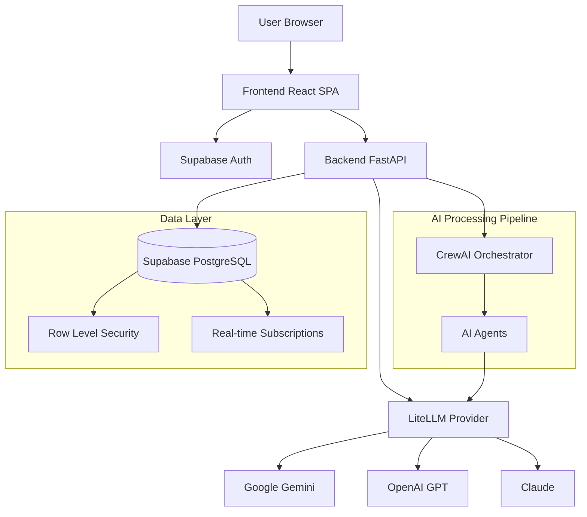

# System Architecture

## 1. High-Level Architecture

The Magure Idea Hub is a multi-service application with persistent storage, AI orchestration, and enterprise authentication:

1.  **Frontend Service:** React-based SPA with Supabase Auth integration
2.  **Backend Service:** Python FastAPI application with LiteLLM provider abstraction and CrewAI orchestration
3.  **Database Service:** Supabase PostgreSQL with Row Level Security (RLS) and real-time subscriptions
4.  **AI Orchestration:** CrewAI flows managing multi-agent workflows for idea processing
5.  **External AI Providers:** Multiple LLM providers (Gemini, OpenAI, etc.) via LiteLLM

**Key Interactions:**

*   The **Frontend** authenticates users via Supabase Auth and makes authenticated API calls to the **Backend Service**
*   The **Backend Service** uses LiteLLM for provider-agnostic AI calls and CrewAI for orchestrating multi-agent workflows
*   **Supabase PostgreSQL** provides persistent storage with RLS for multi-tenant security
*   **CrewAI flows** manage the idea processing pipeline from capture to approval
*   **Real-time subscriptions** enable live UI updates as ideas progress through stages

## 2. Frontend Architecture

The frontend is built using React and TypeScript, now integrated with Supabase for authentication and data persistence.

*   **Core Library:** React 19
*   **Language:** TypeScript
*   **Styling:** Tailwind CSS, with global styles and utility classes defined in `index.html` and component-specific classes
*   **Authentication:** Supabase Auth with JWT token management
*   **State Management:**
    *   React Hooks (`useState`, `useEffect`) for component-level state
    *   Supabase real-time subscriptions for live data updates
    *   The main application state (list of ideas, current workflow state, questionnaire data) is managed in `App.tsx`
    *   Transitioning from localStorage to API-based persistence
*   **Routing:** Implicit routing based on the `workflowState` in `App.tsx`. The application is a single-page app where different views/components are rendered conditionally based on this state
*   **Key Components:**
    *   `App.tsx`: The root component, manages overall application state, workflow, and orchestrates rendering of other components
    *   `AuthContext.tsx`: Manages Supabase authentication state and user context
    *   `LoginPage.tsx`: Handles user authentication flow
    *   `IdeaList.tsx` & `IdeaCard.tsx`: Display the list of submitted ideas with real-time updates
    *   `CategorySelector.tsx`: Allows users to select categories for a new idea (now fetches from API)
    *   `Questionnaire.tsx`: Provides the AI chat interface for elaborating on an idea
    *   `Meters.tsx`: Displays visual meters for Clarity, Value, and Readiness scores
    *   `icons.tsx`: Contains SVG icon components
*   **Service Layer:**
    *   `services/geminiService.ts`: Abstracted layer for making API calls to the backend service
    *   `lib/supabase.ts`: Supabase client configuration and utilities
*   **Type Definitions:**
    *   `types.ts`: Contains shared TypeScript interfaces and enums for data structures used throughout the frontend and backend
*   **Build & Dependencies:**
    *   Dependencies are managed via an `importmap` in `index.html`, pulling modules from `esm.sh`
    *   No explicit build step for the frontend is defined in the current setup (relies on browser's ES module support)

## 3. Backend Architecture

The backend is a Python service built with FastAPI, featuring comprehensive authentication, database integration, and AI orchestration.

*   **Core Framework:** FastAPI (Python 3.12+)
*   **Authentication:** JWT-based authentication with Supabase integration
*   **Database:** Supabase PostgreSQL with async client and Row Level Security (RLS)
*   **AI Integration:** LiteLLM for provider abstraction and CrewAI for multi-agent orchestration
*   **API Endpoints:**
    *   `POST /api/v1/categorize`: AI-powered idea categorization
    *   `POST /api/v1/evaluate`: AI-powered evaluation of user answers in questionnaire
    *   `GET/POST/PATCH/DELETE /api/v1/ideas`: Full CRUD operations for ideas
    *   `GET /api/v1/categories`: Dynamic category taxonomy
    *   `PATCH /api/v1/ideas/{id}/status`: Status updates from AI agents
    *   `PATCH /api/v1/ideas/{id}/value`: ROI band selections and value score updates
    *   `POST /api/v1/crewai/trigger`: CrewAI workflow triggers
*   **LiteLLM Provider Integration:**
    *   Supports multiple LLM providers (Gemini, OpenAI, Claude, etc.)
    *   Provider selection configurable per category or use case
    *   Centralized API key management and rate limiting
*   **CrewAI Orchestration:**
    *   Multi-agent workflows for idea processing pipeline
    *   Asynchronous task execution with webhook callbacks
    *   Agent specialization by idea category and processing stage
*   **Service Layer:**
    *   `services/ai_service.py`: LiteLLM integration and prompt management
    *   `services/idea_service.py`: Business logic for idea CRUD operations
    *   `services/roi_service.py`: ROI calculation and value score normalization
    *   `services/category_service.py`: Dynamic category taxonomy management
*   **Configuration:**
    *   Environment variables managed via `.env` file and Pydantic settings
    *   Multiple AI provider API keys and configuration
    *   Supabase connection string and auth configuration
*   **Error Handling & Middleware:**
    *   Comprehensive input validation via Pydantic models
    *   CORS middleware for frontend-backend interaction
    *   JWT token validation middleware
    *   Structured error responses with appropriate HTTP status codes
*   **Build & Run:**
    *   Managed with `poetry` for dependency management
    *   Docker containerization for deployment
    *   Run with `uvicorn app.main:app` with hot reloading in development

## 4. Data Storage & Management

*   **Primary Database:** Supabase PostgreSQL with the following key tables:
    *   `users`: User profiles and authentication data
    *   `ideas`: Core idea data with lifecycle status
    *   `idea_tags`: Category tags with confidence scores and sources
    *   `idea_answers`: Questionnaire responses
    *   `idea_chat_messages`: AI interview conversation history
    *   `idea_value_selections`: ROI band selections
    *   `idea_categories`: Dynamic category taxonomy with rules and weights
    *   `workflow_events`: Audit trail of idea processing events
*   **Row Level Security (RLS):** Comprehensive policies ensuring users can only access their own data and appropriate shared data based on roles
*   **Real-time Subscriptions:** Live updates for idea status changes and new submissions
*   **Data Migration:** Versioned migrations with rollback support
*   **Backup & Recovery:** Automated Supabase backups with point-in-time recovery

## 5. AI Processing Pipeline

The AI processing pipeline is orchestrated by CrewAI and consists of specialized agents handling different stages:

*   **Idea Intake Agent:** Initial idea capture and basic validation
*   **Enrichment Agent:** Interactive questionnaire and idea elaboration
*   **Categorization Agent:** AI-powered category tagging with confidence scores
*   **Screening Agent:** Automated filtering and quality assessment
*   **Evaluation Agent:** Structured evaluation against category-specific criteria
*   **Workflow Orchestration Agent:** Status management and routing between stages

Each agent uses LiteLLM for provider-agnostic AI calls and can be configured to use different models based on the task requirements.

## 6. Security & Authentication

*   **Authentication:** Supabase Auth with JWT tokens
*   **Authorization:** Role-based access control with fine-grained permissions
*   **API Security:** All endpoints require valid JWT tokens
*   **Data Security:** 
    *   Row Level Security (RLS) policies at the database level
    *   API key management for external AI services
    *   Secure environment variable handling
*   **Input Validation:** Comprehensive validation using Pydantic models
*   **CORS:** Properly configured for frontend-backend communication
*   **Rate Limiting:** Protection against API abuse (planned)

## 7. Deployment & Operations

*   **Containerization:** Docker containers for both frontend and backend services
*   **Orchestration:** Docker Compose for local development and testing
*   **Database:** Managed Supabase PostgreSQL instance
*   **Monitoring:** Structured logging and error tracking (planned)
*   **CI/CD:** Automated testing and deployment pipelines (planned)

This architecture provides a robust, scalable foundation for the AI-powered idea management platform with clear separation of concerns, comprehensive security, and flexible AI processing capabilities.
