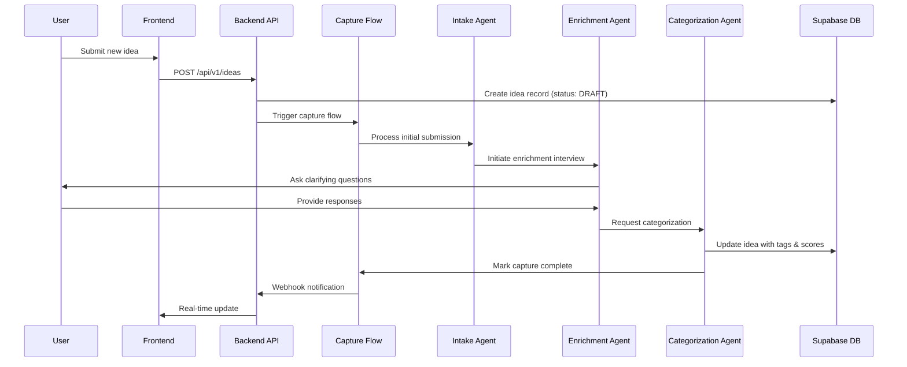
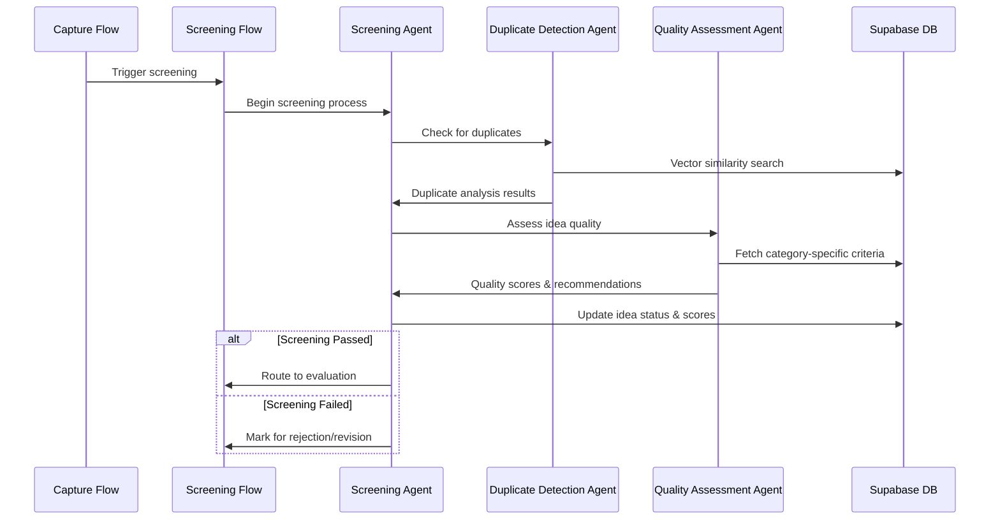
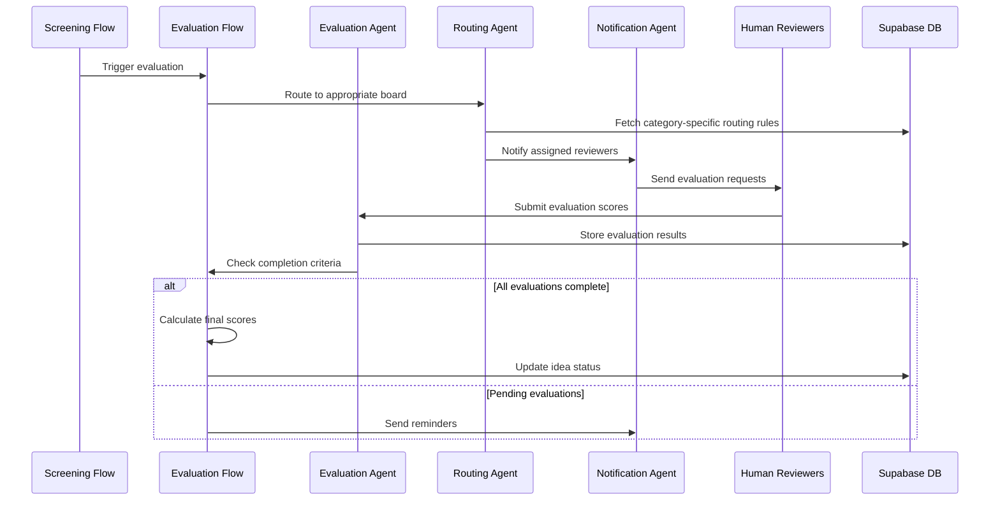
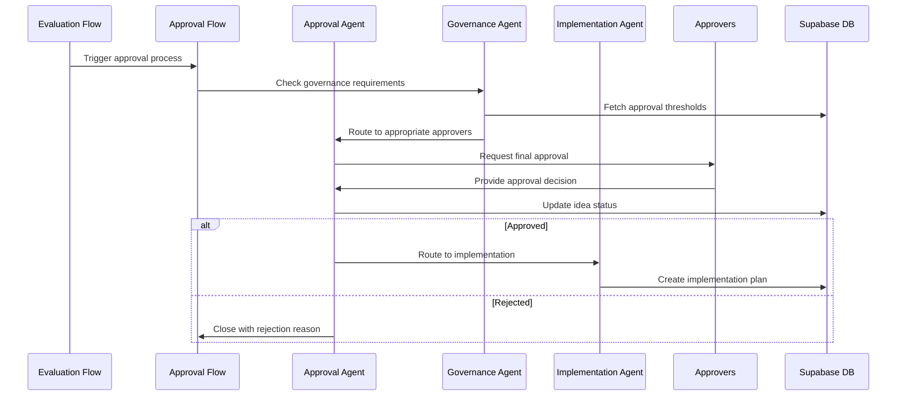

# CrewAI Flows & Multi-Agent Orchestration

This document describes how CrewAI manages the multi-agent workflows that power the idea processing pipeline in the Magure Idea Hub.

## 1. Overview

CrewAI orchestrates specialized AI agents through structured flows that mirror the idea lifecycle stages. Each flow represents a distinct phase of processing, with agents collaborating to move ideas through the pipeline from initial capture to final approval.

## 2. Core Flows

### Capture Flow
**Trigger:** User submits new idea  
**Purpose:** Initial intake and basic enrichment  
**Duration:** Real-time (< 30 seconds)



### Screening Flow
**Trigger:** Capture flow completion  
**Purpose:** Automated quality assessment and duplicate detection  
**Duration:** 1-5 minutes



### Evaluation Flow
**Trigger:** Screening flow success  
**Purpose:** Structured evaluation by human reviewers with AI assistance  
**Duration:** 2-7 days



### Approval Flow
**Trigger:** Evaluation flow completion  
**Purpose:** Final approval decision and routing to implementation  
**Duration:** 1-3 days



## 3. Agent Specifications

### Intake Agent
**Role:** Initial idea validation and setup  
**Tools:** 
- Idea validation toolkit
- Basic quality assessment
- User communication interface

**Prompts:** Category-agnostic intake validation

### Enrichment Agent
**Role:** Interactive idea elaboration through AI interview  
**Tools:**
- Dynamic questioning framework
- Conversation management
- Quality scoring algorithms

**Prompts:** Category-specific question sets from `agent-inquirer-question-model.csv`

### Categorization Agent
**Role:** AI-powered category tagging and confidence scoring  
**Tools:**
- Multi-label classification
- Confidence scoring
- Category taxonomy lookup

**Prompts:** Category-specific classification with reasoning

### Screening Agent
**Role:** Automated quality and duplicate assessment  
**Tools:**
- Vector similarity search
- Quality rubric evaluation
- Business rule validation

**Prompts:** Category-specific screening criteria

### Evaluation Agent
**Role:** Coordinate human evaluation process  
**Tools:**
- Evaluation workflow management
- Score aggregation
- Notification system

**Prompts:** Evaluation guidance and reminder templates

### Approval Agent
**Role:** Final approval coordination and routing  
**Tools:**
- Governance rule engine
- Approval workflow management
- Implementation handoff

**Prompts:** Approval criteria and routing logic

## 4. Flow Configuration

### Environment Variables
```bash
# CrewAI Configuration
CREWAI_API_KEY=your_crewai_key
CREWAI_MODEL_PROVIDER=litellm
CREWAI_DEFAULT_MODEL=gpt-4o-mini

# LiteLLM Integration
LITELLM_PROVIDER_GEMINI=gemini/gemini-2.0-flash-exp
LITELLM_PROVIDER_OPENAI=openai/gpt-4o-mini
LITELLM_PROVIDER_ANTHROPIC=anthropic/claude-3-haiku

# Flow Timeouts
CAPTURE_FLOW_TIMEOUT=300  # 5 minutes
SCREENING_FLOW_TIMEOUT=900  # 15 minutes
EVALUATION_FLOW_TIMEOUT=604800  # 7 days
APPROVAL_FLOW_TIMEOUT=259200  # 3 days
```

### Category-Specific Configuration
Each category can override default agent behavior and model selection:

```yaml
categories:
  PRODUCT_INNOVATION:
    enrichment_model: "gpt-4o"
    screening_model: "gemini-2.0-flash"
    evaluation_timeout: 5  # days
    required_approvers: ["Product SteerCo"]
  
  REGULATORY_COMPLIANCE:
    enrichment_model: "claude-3-opus"
    screening_model: "gpt-4o"
    evaluation_timeout: 10  # days
    required_approvers: ["Reg-Ops", "Legal"]
```

## 5. Flow Monitoring & Observability

### Flow State Tracking
Each flow execution is tracked with:
- Flow ID and execution timestamp
- Current stage and agent status
- Performance metrics (latency, token usage)
- Error logs and retry attempts

### Webhooks & Notifications
Flows can trigger webhooks for:
- Stage completion
- Error conditions
- Timeout warnings
- Manual intervention required

### Dashboard Metrics
Key metrics tracked for operational monitoring:
- Flow completion rates by category
- Average processing time per stage
- Agent performance and accuracy scores
- Bottleneck identification and resolution

## 6. Error Handling & Recovery

### Retry Logic
- Automatic retry for transient failures
- Exponential backoff for rate limiting
- Manual retry triggers for complex failures

### Escalation Procedures
- Automatic escalation after multiple failures
- Human intervention points for complex decisions
- Fallback to manual processing when needed

### Data Consistency
- Transactional updates across flow stages
- State recovery mechanisms for interrupted flows
- Audit trails for all flow decisions and actions

This CrewAI orchestration provides a robust, scalable framework for processing ideas through the complete lifecycle while maintaining flexibility for category-specific requirements and human oversight where appropriate.
