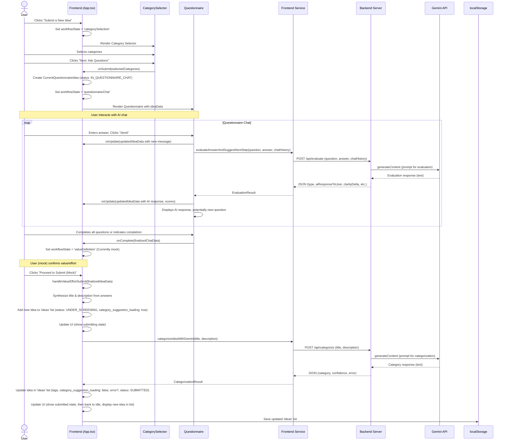
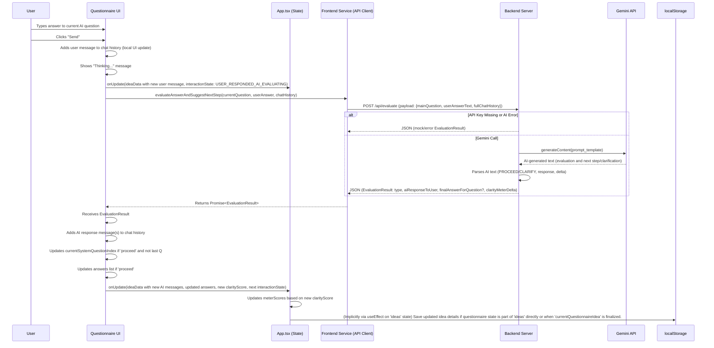
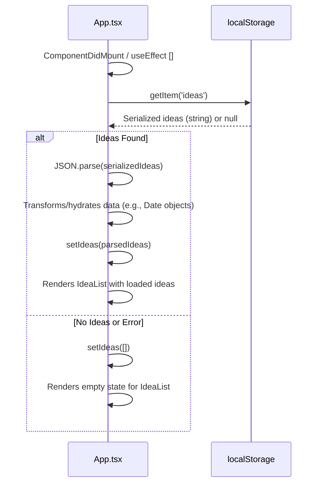

# Data Flow Diagrams

This section describes the data flow for key user interactions within the Magure Idea Hub.

## 1. New Idea Submission & Initial Categorization

This flow covers the process from a user starting a new idea to it being listed with an AI-suggested category.

## 2. Questionnaire Chat Interaction (Single Turn)

This focuses on a single exchange within the AI-driven questionnaire.

## 3. Loading Ideas from LocalStorage

This flow describes how ideas are loaded when the application starts.

These diagrams illustrate the primary interactions and data movements. The actual implementation involves React state updates and re-renders triggered by these flows.
