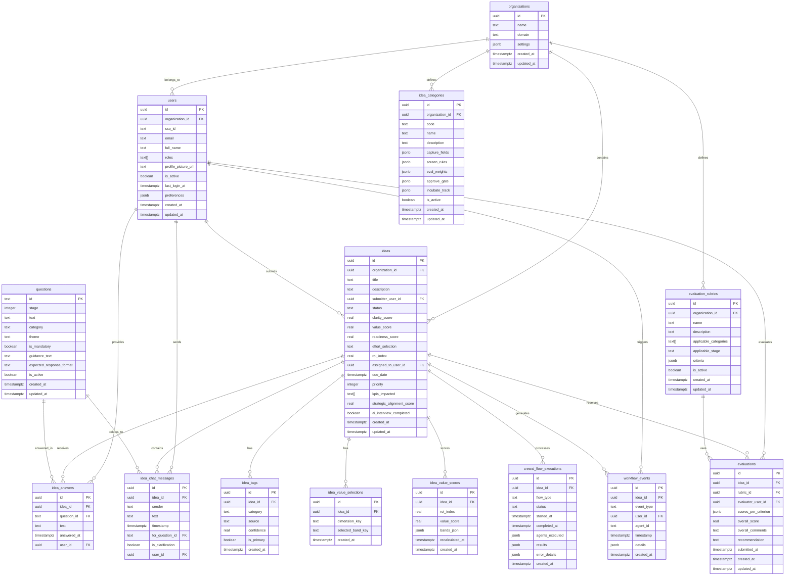

# Data Model & Entity Relationship Diagram

This document provides a comprehensive overview of the database schema and entity relationships in the Magure Idea Hub.

## Entity Relationship Diagram



## Table Descriptions

### Core Entities

#### `organizations`
Multi-tenant organization container for all data isolation.
- **Primary Use:** Tenant separation in SaaS deployment
- **Key Relationships:** Parent to all other entities
- **RLS:** Users can only access their organization's data

#### `users`
User profiles with role-based access control.
- **Primary Use:** Authentication, authorization, audit trails
- **Key Fields:** `roles` (array for multiple roles), `sso_id` for external auth
- **RLS:** Users see their own profile + colleagues in same org

#### `idea_categories`
Dynamic category taxonomy with processing rules.
- **Primary Use:** Category-specific agent behavior and evaluation criteria
- **Key Fields:** `capture_fields`, `screen_rules`, `eval_weights` (JSONB)
- **Source:** Migrated from `docs/explanation/idiea-categories.md`

### Idea Management

#### `ideas`
Core idea entities with lifecycle status tracking.
- **Primary Use:** Central idea storage and status management
- **Key Fields:** `status` (enum), scoring fields, assignment tracking
- **RLS:** Submitters see own drafts, all users see submitted ideas

#### `idea_tags`
Multi-label category classification with confidence scoring.
- **Primary Use:** AI categorization and human refinement
- **Key Fields:** `source` (user/AI), `confidence`, `is_primary`
- **Cardinality:** Many tags per idea for multi-label classification

#### `idea_answers`
Structured questionnaire responses.
- **Primary Use:** Enrichment data collection and analysis
- **Key Relationships:** Links to predefined questions and ideas
- **RLS:** Linked to idea access permissions

#### `idea_chat_messages`
AI interview conversation history.
- **Primary Use:** Interactive enrichment dialogue tracking
- **Key Fields:** `sender` (user/ai), question context linking
- **Ordering:** Chronological by timestamp

### Value Assessment

#### `idea_value_selections`
User-selected value bands for ROI calculation.
- **Primary Use:** Privacy-preserving ROI input collection
- **Key Fields:** `dimension_key` (revenue, cost, risk), `selected_band_key`
- **Source:** Implements guide-to-roi-calculation.md methodology

#### `idea_value_scores`
Calculated ROI metrics and normalized value scores.
- **Primary Use:** Historical tracking of value score calculations
- **Key Fields:** `roi_index` (formula result), `value_score` (percentile normalized)
- **Updates:** Nightly recalculation job maintains historical data

### Evaluation & Workflow

#### `evaluation_rubrics`
Category-specific evaluation criteria and weights.
- **Primary Use:** Structured human evaluation framework
- **Key Fields:** `criteria` (JSONB), `applicable_categories`
- **Source:** Derived from category-specific evaluation weights

#### `evaluations`
Human evaluator scores and recommendations.
- **Primary Use:** Structured evaluation data collection
- **Key Fields:** `scores_per_criterion`, `overall_score`, `recommendation`
- **RLS:** Evaluators see assigned evaluations

#### `workflow_events`
Audit trail of idea processing events.
- **Primary Use:** Status change tracking, debugging, analytics
- **Key Fields:** `event_type`, `agent_id`, `details` (JSONB)
- **Retention:** Permanent audit trail

#### `crewai_flow_executions`
CrewAI workflow execution tracking.
- **Primary Use:** Flow monitoring, debugging, performance analysis
- **Key Fields:** `flow_type`, `agents_executed`, `results`
- **Updates:** Real-time updates during flow execution

## Data Mapping: Pydantic ↔ Supabase

| Pydantic Model | Supabase Table | Key Differences |
|----------------|----------------|-----------------|
| `Organization` | `organizations` | Direct mapping |
| `User` | `users` | `roles` as TEXT[] array |
| `Idea` | `ideas` | Flattened value/quality metrics |
| `IdeaTag` | `idea_tags` | Separate table for many-to-many |
| `Question` | `questions` | Static/predefined questions |
| `Response` | `idea_answers` | Renamed for clarity |
| `ChatMessage` | `idea_chat_messages` | Added idea context |
| `IdeaValueAssessment` | `idea_value_selections` + `idea_value_scores` | Split into selections and calculated scores |
| `EvaluationRubric` | `evaluation_rubrics` | Direct mapping with JSONB criteria |
| `Evaluation` | `evaluations` | Direct mapping |
| `WorkflowEvent` | `workflow_events` | Direct mapping |
| N/A | `crewai_flow_executions` | Database-only for flow tracking |

## Indexes & Performance

### Primary Indexes
```sql
-- Composite indexes for common queries
CREATE INDEX idx_ideas_status_created ON ideas(status, created_at DESC);
CREATE INDEX idx_ideas_submitter_status ON ideas(submitter_user_id, status);
CREATE INDEX idx_ideas_organization_status ON ideas(organization_id, status);

-- Tag-based filtering
CREATE INDEX idx_idea_tags_category ON idea_tags(category, is_primary);
CREATE INDEX idx_idea_tags_idea_primary ON idea_tags(idea_id, is_primary);

-- Chat and answers for idea detail loading
CREATE INDEX idx_chat_messages_idea_timestamp ON idea_chat_messages(idea_id, timestamp);
CREATE INDEX idx_answers_idea_question ON idea_answers(idea_id, question_id);

-- Value selections for ROI calculations
CREATE INDEX idx_value_selections_idea ON idea_value_selections(idea_id);

-- Workflow events for audit trails
CREATE INDEX idx_workflow_events_idea_type ON workflow_events(idea_id, event_type);
CREATE INDEX idx_workflow_events_timestamp ON workflow_events(timestamp DESC);

-- Flow executions for monitoring
CREATE INDEX idx_flow_executions_status ON crewai_flow_executions(status, started_at);
```

### Full-Text Search
```sql
-- Full-text search on ideas
CREATE INDEX idx_ideas_fts ON ideas USING gin(to_tsvector('english', title || ' ' || description));

-- Category search
CREATE INDEX idx_categories_fts ON idea_categories USING gin(to_tsvector('english', name || ' ' || description));
```

## Row Level Security (RLS) Policies

### Multi-Tenant Isolation
```sql
-- Users can only access their organization's data
CREATE POLICY "org_isolation" ON ideas
  FOR ALL USING (organization_id = auth.jwt() ->> 'org_id');

-- Similar policies on all org-scoped tables
CREATE POLICY "org_isolation" ON idea_categories
  FOR ALL USING (organization_id = auth.jwt() ->> 'org_id');
```

### Idea Access Control
```sql
-- Submitters can manage their draft ideas
CREATE POLICY "submitter_draft_access" ON ideas
  FOR ALL USING (
    submitter_user_id = auth.uid() AND status = 'DRAFT'
  );

-- All authenticated users can read submitted ideas
CREATE POLICY "submitted_ideas_read" ON ideas
  FOR SELECT USING (status != 'DRAFT');

-- Evaluators can read assigned ideas
CREATE POLICY "evaluator_access" ON ideas
  FOR SELECT USING (
    EXISTS (
      SELECT 1 FROM evaluations e 
      WHERE e.idea_id = ideas.id 
      AND e.evaluator_user_id = auth.uid()
    )
  );
```

### Admin Override
```sql
-- Admins have full access
CREATE POLICY "admin_full_access" ON ideas
  FOR ALL USING (
    EXISTS (
      SELECT 1 FROM users 
      WHERE id = auth.uid() 
      AND 'ADMIN' = ANY(roles)
    )
  );
```

## Migration Strategy

### Phase 1: Core Tables (Week 1)
1. `organizations`, `users` (already exists)
2. `idea_categories`, `ideas` (enhanced existing)
3. `idea_tags`, `idea_value_selections`

### Phase 2: Enrichment Tables (Week 2)
1. `questions`, `idea_answers`, `idea_chat_messages`
2. `idea_value_scores`, `workflow_events`

### Phase 3: Evaluation Tables (Week 3)
1. `evaluation_rubrics`, `evaluations`
2. `crewai_flow_executions`

### Data Migration Scripts
- **Category Migration:** Parse markdown → YAML → database
- **RLS Policy Updates:** Apply new security policies
- **Index Creation:** Performance optimization
- **Data Validation:** Ensure referential integrity

This data model provides a robust foundation for the multi-agent AI platform while maintaining performance, security, and scalability requirements.
